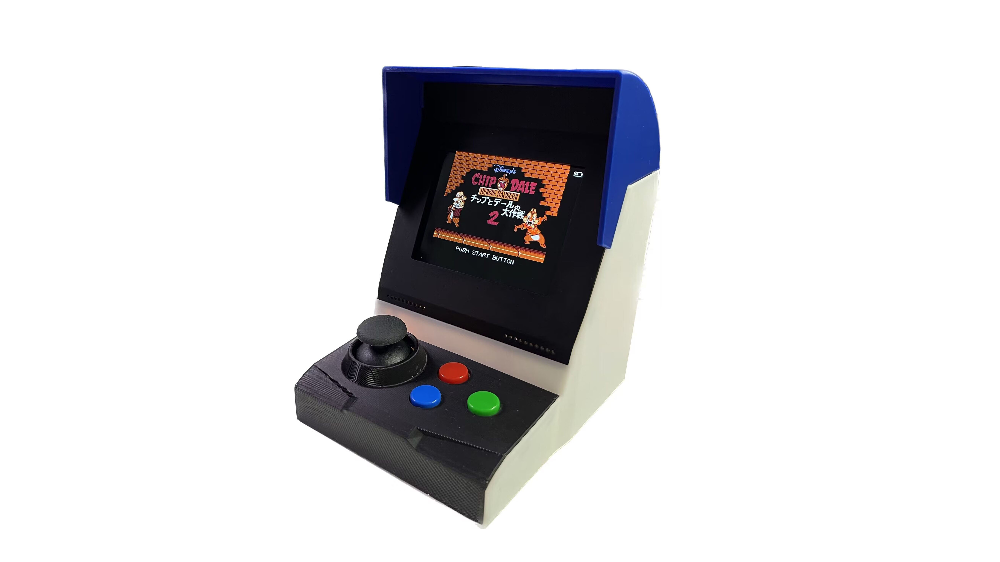
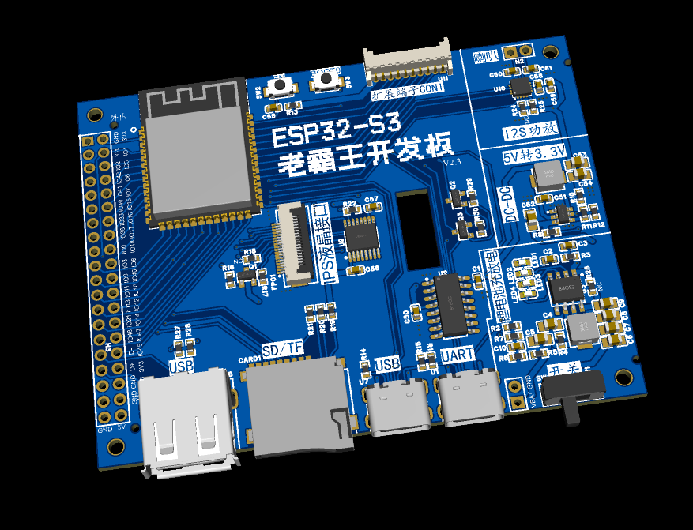
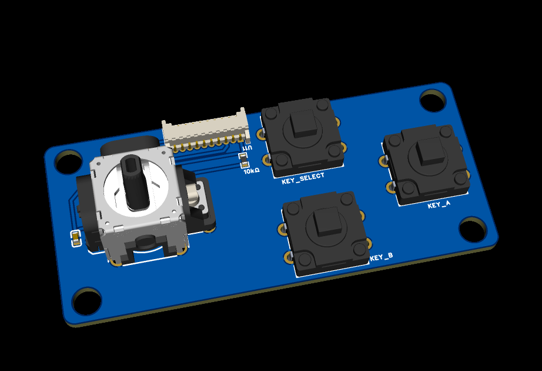
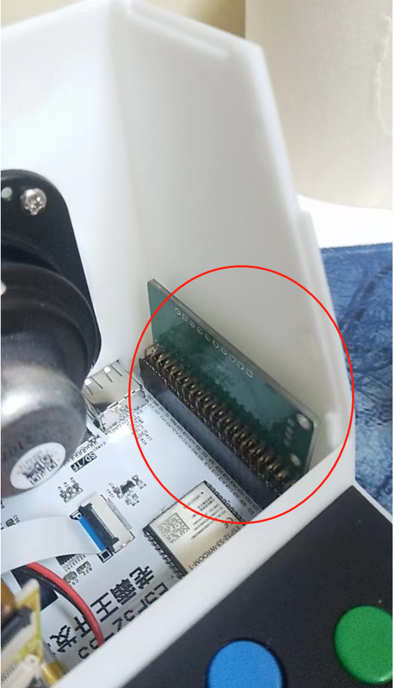
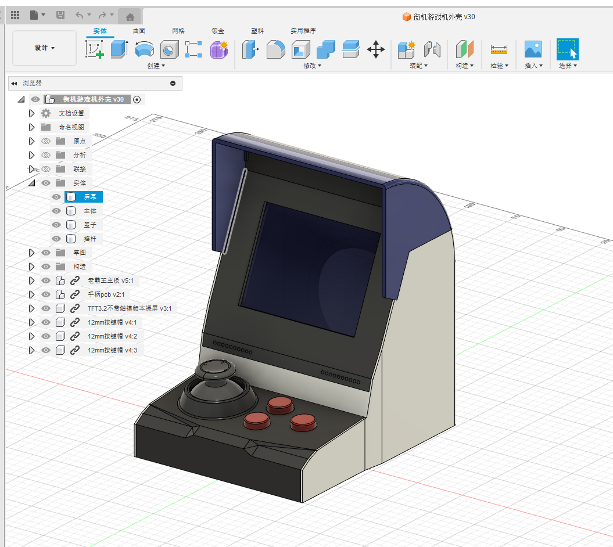

# esp32s3_nes_gamer

# ESP32_S3老霸王游戏机摆件  
*******************************************************************************************  
 “啊啊，老霸王其乐无穷啊”                                                                       
 ESP32-S3 老霸王学习机 V1.0                                                                                                    
 致我们终将（划掉）已经逝去的青春                                                               
 模拟器代码重写自 NESCAT ESP32 NES模拟器v0.5     https://github.com/markoni985/NesCat             
 AIDA64后台代码改写自         https://github.com/ClimbSnail/HoloCubic_AIO/里的 pc_resource app       
 UI界面修改自                https://github.com/Melonhead60/_PixelPerfect                                 
 适配老霸王ESP32—S3开发板，一块能当游戏机的开发板，一块不止能当游戏机的开发板   
 ”学编程，用老霸王“（手动狗头）    
*******************************************************************************************  

# 功能简介
基于ESP32-S3的游戏机摆件，可以玩NES游戏，最大支持1M的大容量ROM.
游戏支持机器上手柄/微信小程序手柄/HID手柄/HID键盘【支持双打】。
XBOX和PS4手柄等需要添加模块才能支持。已经适配。
附加：播放MJPEG视频/电脑状态监控等功能

# 作者：
up：萨纳兰的黄昏
up：神秘藏宝室
# 视频展示
https://www.bilibili.com/video/BV1eh4y1F7rn
# Q群
群号：739444215，细节资料群共享下载
# 源码
整体代码使用arduino框架，基于VSCODE+PlatFormIO平台开发，本代码也已经适配，项目：神之眼【up：萨纳兰的黄昏】，项目：50mm分光棱镜大电视【up：神秘藏宝室】
代码开源地址：https://github.com/planevina/esp32s3_nes_gamer 
经过2个月折腾，尝试了github上所有的nes模拟器，要么速度太慢，要么bug太多，要么是idf版本的，踩坑无数，都是泪。
最终主模拟器代码框架使用GitHub NESCat项目，重新整理和修复，移植到S3，并且很多处理都移在PSRAM上执行，载入和运行速度快了十几倍。毕竟咱使用的N16R8模组，有8M PSRAM任性。并且把能模拟的ROM，增加到1MB，目前除了一些特别大的ROM，和一些魔改的ROM不能运行，大部分ROM游戏都可以顺畅模拟。
# 功能简介
1.做为NES游戏的模拟器，解析游戏后3.2寸彩屏显示游戏，I2S输出声音信号，选了一个超级震撼的喇叭，声音配合着震动，感觉很棒！
    可静音、可设置开机自动启动应用和某个游戏【做为一个摆件，开机就运行某个游戏演示，很酷】
2.副功能：MJPEG播放器，播放MJPEG视频文件【可设置开机自启动应用】
3.副功能：电脑监控副屏，配合AIDA64，显示电脑CPU/内存等实时使用状态【可设置开机自启动应用】

# 硬件
## 1.老霸王核心板
不仅可以用于本游戏机项目，也可以作为一个全面的ESP32-S3的开发板用，IO和电源扩展2.54间距的排针接口引出，可以适应扩展以后想要的任何功能。
核心板具有：
UART接口：可烧录调试
USB typec接口：可烧录，和设计USB应用
TF/SD卡接口：MMC模式，最大支持32GB容量
标准USB A口母头：可以扩展HID手柄，HID键盘等
锂电池充放电电路：可以脱离USB线
DC-DC电源：给模组和配件提供足够电源，并且降低电源功耗和发热
I2S音频放大电路：超级舒服的音质
IPS显示屏接口：同时预留了触摸屏电路，可纯粹作为一款ESP32-S3的触摸屏开发板，开发LVGL也很不错，触摸屏还支持直接贴在老霸王核心板背面使用，完美适配。

## 2.摇杆扩展板
用于扩展游戏机前置摇杆和按键

## 3.USB扩展模块
不用XBOX和PS4等手柄可以不做这个板子。
本模块为一个补丁，因为2位up的能力有限，对HID开发不熟悉，目前S3又没有更多的参考代码去直接驱动XBOX和PS4手柄，故用硬件来弥补。
期待哪天其它大神补了这个坑，把S3自带的USB库调试完整。
想扩展PS4或者XBOX手柄使用的朋友，需要做这个扩展板，插在核心板的双排扩展引脚上，并且拆除R27 R28电阻，扩展USB A口母头，可以适配更多USB HID设备。

# 外壳
单独绘制外壳，看自行打印

# 更多
更多细节自制时候体会，细节拉满。Q群共享也提供有更多制作资料，BOM推荐购买清单元件链接等，也可以和其它志同道合的朋友一起制作。
加油，做你自己的游戏机吧，给自己的童年一个交代~
